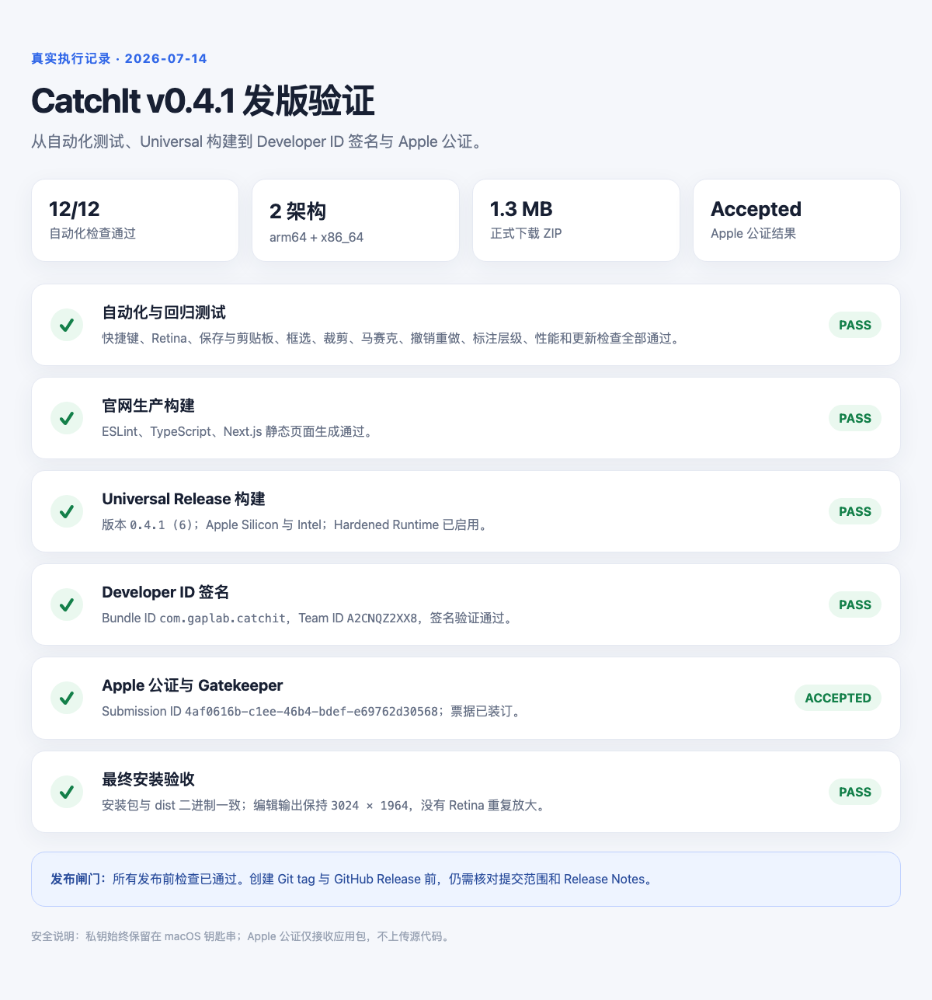
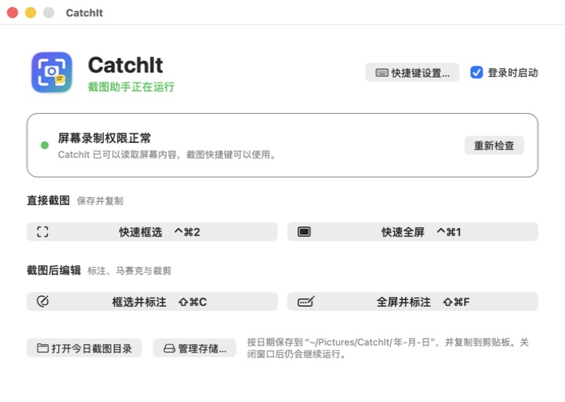
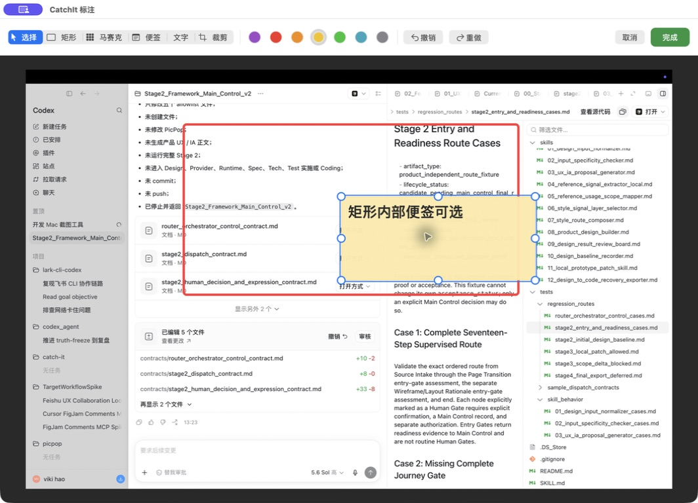

# CatchIt 图文发版 Runbook

这份文档记录 CatchIt 从改动完成到 GitHub Release 和官网下载验证的完整流程。示例结果来自 2026-07-14 的 `v0.4.1` 真实发版演练。

> 安全边界：Developer ID 私钥始终留在 macOS 钥匙串中；Apple ID 密码、App 专用密码和 GitHub token 由用户在系统或官网安全界面输入，不写进命令、仓库、截图或日志。

## 一、总览



完整流程对应 FigJam：[CatchIt 从首次部署到日常发版](https://www.figma.com/board/kN9OTd8jwbLhKFUsQPILc6)

## 二、首次发布准备

1. 在 Apple Developer 创建并安装 `Developer ID Application` 证书。
2. 在本机保存 Apple 公证凭据：

   ```bash
   xcrun notarytool store-credentials catchit-notary
   ```

3. 确认 GitHub、官网和应用内更新检查都指向 `bubbleviki404/catch-it`。
4. 不要把证书私钥、密码、App 专用密码或 GitHub token 提交到仓库。

## 三、每次发布

### 1. 核对工作区和版本

```bash
git status --short
git diff
/usr/libexec/PlistBuddy -c 'Print :CFBundleShortVersionString' Resources/Info.plist
/usr/libexec/PlistBuddy -c 'Print :CFBundleVersion' Resources/Info.plist
```

补丁版本示例：`0.4.0 → 0.4.1`，build number 同时递增：`5 → 6`。

### 2. 自动化测试

```bash
./scripts/run-self-tests.sh
```

测试必须覆盖：全局快捷键、Retina 像素、保存/剪贴板、框选、标注、裁剪、马赛克、撤销重做、性能和更新检查。任何失败都停止发布。

### 3. 官网验证

```bash
cd website
npm run lint
npm run build
```

`next build` 应显示首页、CatchIt 下载页和隐私页均为 Static。

### 4. 正式签名与 Apple 公证

```bash
CATCHIT_RELEASE=1 \
CATCHIT_CODESIGN_IDENTITY="Developer ID Application: hua hao (A2CNQZ2XX8)" \
CATCHIT_NOTARY_PROFILE="catchit-notary" \
CATCHIT_GITHUB_REPOSITORY="bubbleviki404/catch-it" \
./scripts/build-app.sh
```

成功标志：`valid on disk`、`satisfies its Designated Requirement`、`status: Accepted`、`The staple and validate action worked!`、`source=Notarized Developer ID`。

### 5. 像普通用户一样安装

退出旧版，把 `dist/CatchIt.app` 拖到“应用程序”并选择覆盖，然后启动。



检查：权限正常、菜单栏入口存在、四个快捷键可用、快速截图写入当日目录并复制、图片保持物理像素、编辑完成后给出反馈。

### 6. 矩形与便签层级回归

创建大矩形并在内部放置便签。点击便签内容应选中便签；点击矩形边框仍应选中矩形。



### 7. 发布 GitHub Release

只有全部验收通过后才执行：

```bash
git add <本次变更>
git commit -m "Release CatchIt 0.4.1"
git tag v0.4.1
git push origin main
git push origin v0.4.1
```

创建正式 GitHub Release，并上传：

- `dist/CatchIt-v0.4.1-universal.zip`
- `dist/CatchIt-latest.zip`

不要标记 Draft 或 Prerelease。官网始终下载固定名称 `CatchIt-latest.zip`。

### 8. 发布后验证

1. 检查 GitHub tag、Release Notes 和两个 ZIP。
2. 从官网实际下载，不直接使用本地 `dist`。
3. 解压启动，确认 Gatekeeper 不报错。
4. 核对下载 ZIP 的 SHA-256。
5. 在没有开发环境的 Mac 上验证首次授权、快捷键、截图、编辑和覆盖升级。

## 四、v0.4.1 演练记录

- 自动化测试、官网 lint/build：通过。
- 架构：`arm64 + x86_64`。
- Apple 公证：`Accepted`。
- Submission ID：`4af0616b-c1ee-46b4-bdef-e69762d30568`。
- ZIP SHA-256：`cc1a96e4fe9d6f7558eddb499e75845f3bdcc1557a59fdf33a87bbc1e70aeea8`。
- 最终人工验收：编辑输出 `3024 × 1964`，与原始截图一致。
